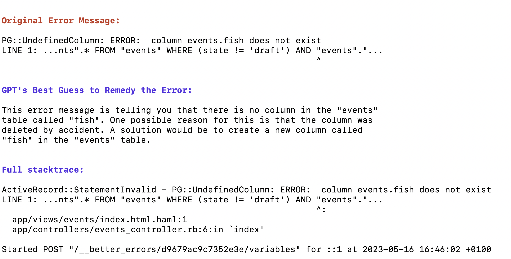

# ChatGptErrorHandler

This gem pops a little helpful ChatGPT message before your error stacktrace.



## Usage

Add this line to your application's Gemfile:

```ruby
gem "chat_gpt_error_handler"
```

Set your [OpenAI API Token](https://openai.com/product#made-for-developers) and enable the gem in an initializer:

```ruby
# config/initializers/chat_gpt_error_handler.rb
ChatGptErrorHandler.openai_access_token = 'your_openai_access_token_here'
ChatGptErrorHandler.enabled = true
```

And you're off!

## License
The gem is available as open source under the terms of the [MIT License](https://opensource.org/licenses/MIT).
